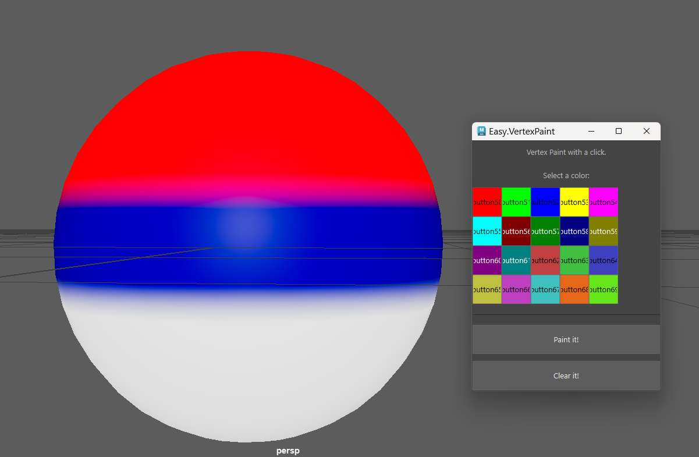

# Easy.VertexPaint

## My problem!
I was modeling a house and thought about using vertex painting to texture it in Substance 3D Painter, applying different textures to each part of the house. However, I didn’t want to create separate materials for it. Importing it into Unreal Engine with multiple materials would be tedious to manage—it's really annoying. So...

Why not create a simple tool to vertex paint my model without dealing with the complexity of Maya's built-in Vertex Paint tool?

## My solution
It should be done with just two clicks... that's the limit. Easy, fast, and straightforward.

## How to install
1. Open Maya.
2. Go to the script editor tab.
3. Paste the script into the Python tab or simply drag and drop the `.py` file into Maya’s viewport. Done!

> **Troubleshooting**
> 
>If you encounter any installation errors, make sure PyMEL is installed. Refer to Autodesk’s [how to install and import PyMel on Maya](https://help.autodesk.com/view/MAYAUL/2025/ENU/?guid=GUID-2AA5EFCE-53B1-46A0-8E43-4CD0B2C72FB4).

## How to use

1. Select faces you want to paint.
2. Select a color from the palette.
3. Click Paint it!

> **Forgot to select a color?** 
> 
> No worries! The tool will pick a random color for the faces.
>
> **Painted the wrong color or changed your mind?** 
> 
> Just click Clear it! and repaint as needed.

Enjoy!
